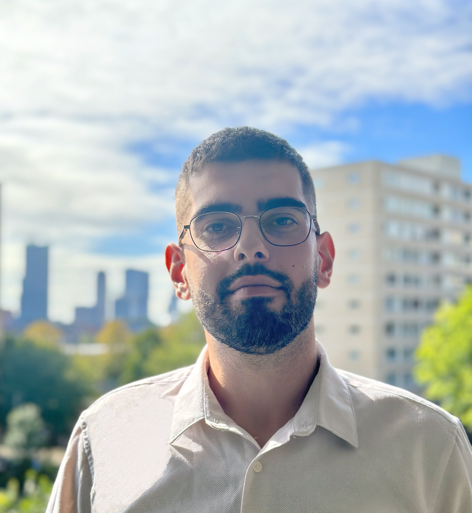

# Erion Mediu's Portfolio

## About Me
I am deeply dedicated to ongoing learning and personal development. With a strong background in data science and finance, I bring a unique blend of analytical skills and strategic thinking to every endeavor. Passionate about leveraging data to drive business decisions and innovation.

---

## Contact Me
- Email: [Erion.mediu7@gmail.com](mailto:Erion.mediu7@gmail.com)
- LinkedIn: [Erion Mediu](https://www.linkedin.com/in/erion-mediu-ba865a17b/)
- Phone: +31 0648736005

---

## Education

### MSc Data Science, Tilburg University
- Focused on Machine Learning, Computational Statistics, Bayesian Multilevel Models, and Deep Learning.
- Committed to acquiring advanced skills in data analytics and its statistical foundations.

### Master in Finance, CFA Track, Tilburg University
- Graduated with distinction in the CFA track.
- Specialized in derivative securities and empirical finance.
- Thesis on "Investor macroeconomic risk perception and cross-sectional returns: an analysis of the US stock market using PVS Metric."

### Bachelor in Business Management, Rotterdam Business School
- Gained a comprehensive understanding of business management in a global context.
- Focused on practical project experience and international collaborations.

---

## Experience

### Intern at Global Process & Control Improvement (P&CI), The Heineken Company
- Revamped dashboard reports for HeiRules and ICFR.
- Supported various compliance processes and identified global operational improvement opportunities.

### Minor in Sustainable Finance, Rotterdam School of Management
- Collaborated with "Stichting het werkt" foundation to fund the Growth Garden project.
- Created a consultancy report for Wärtsilä Corporation focusing on the internal control framework.

### Intern at Deloitte Consulting, Human Capital Services, Deloitte Albania
- Analyzed data across various economic sectors and assisted in drafting reports.
- Focused on key metrics related to incentive programs for staff retention.

---

## Projects

(Here, you can add details about your projects. For each project, provide a brief description, and if applicable, include a link and an image.)

### Project 1: [Project Name]

- Brief description of the project.
- [Link to Project](your-project-link)

### Project 2: [Project Name]

- Brief description of the project.
- [Link to Project](your-project-link)

(Continue adding projects in a similar format.)
